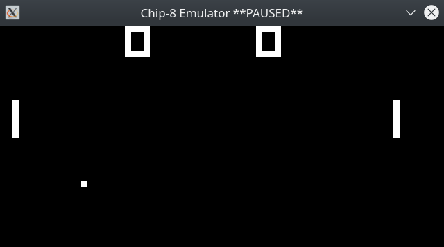
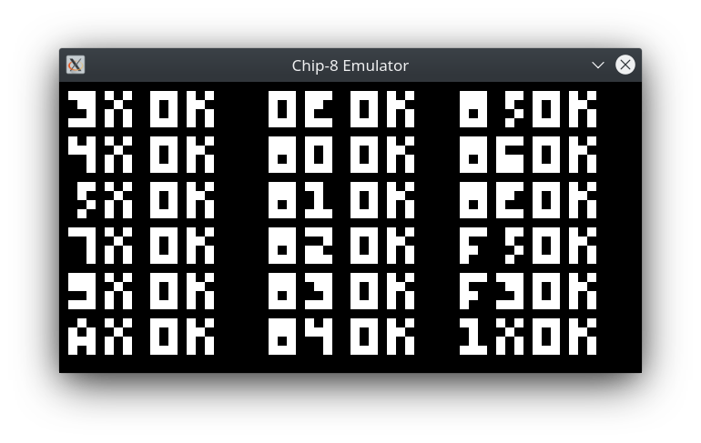

# C8Emulator
Simple Chip-8 emulator written in C++. Uses [SDL2](https://www.libsdl.org/) to render graphics and output sound. Most of the information needed to create this emulator was sourced from the [CHIP-8 Wikipedia Page](https://en.wikipedia.org/wiki/CHIP-8).

Written by [Dane Marguglio](https://github.com/danemarguglio) & [Joel Willoughby](https://github.com/JoelWilloughby) circa 2015.

If you'd like to take an exploration of a CHIP-8 binary, take a look at [Pong Explained](Pong_Explained.md).





<br/>

## Build
Install the [SDL2 development libraries](https://www.libsdl.org/download-2.0.php).

If you're using apt package manager you can install them using 
```console
sudo apt-get install libsdl2-dev
```

Compile the code using the `make` command.
```console
dane@pc:~/repos/C8Emulator$ make
g++ -c -Wall `sdl2-config --cflags` main.cpp -o main.o
g++ main.o Emulator/Chip8Emulator.o Graphics/SDLGraphics.o `sdl2-config --libs` -o Chip8
```
<br/>


## Run
Pass in the path to a binary rom file as a single argument to the application.
```console
dane@pc:~/repos/C8Emulator$ ./Chip8 Roms/PONG
```

## Controls
Input for the Chip-8 was done with a hex keyboard.
- Chip-8 Keyboard
  - 1 2 3 C
  - 4 5 6 D
  - 7 8 9 E
  - A 0 B F


- Mapped Keys
  - 1 2 3 4
  - Q W E R
  - A S D F
  - Z X C V
