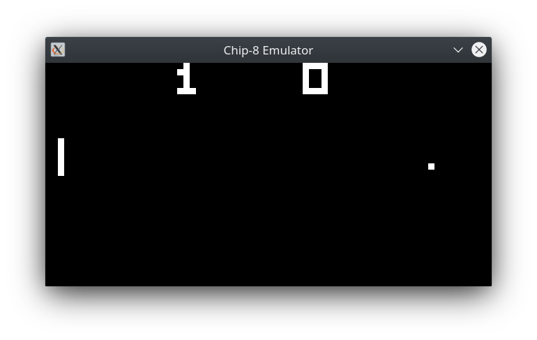
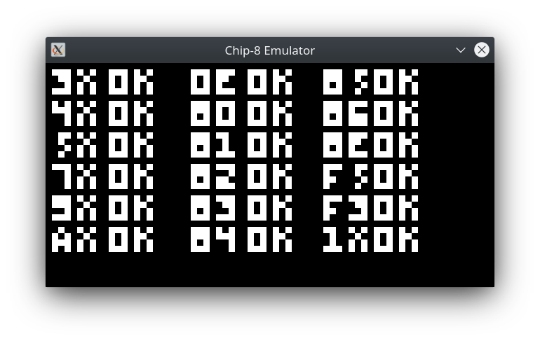

# C8Emulator
Simple Chip-8 emulator written in C++. Uses [SDL2](https://www.libsdl.org/) to render graphics and output sound. Most of the information needed to create this emulator was sourced from the [CHIP-8 Wikipedia Page](https://en.wikipedia.org/wiki/CHIP-8).

Written by [Dane Marguglio](https://github.com/danemarguglio) & [Joel Willoughby](https://github.com/JoelWilloughby) circa 2015.







If you'd like to take an in-depth walkthrough of a CHIP-8 binary, take a look at [Pong Explained](Pong_Explained.md).


<br/>

## Build

Install the [SDL2 development libraries](https://www.libsdl.org/download-2.0.php).

If you're using apt package manager you can install them using 
```console
sudo apt-get install libsdl2-dev
```

Compile the code using the `make` command.


<br/>

## Run
```console
./Chip8 C8Games/PONG
./Chip8 C8Games/CONNECT4
```

### Control
TODO
- 1, 2, 3, 4, q, w, e, r
- a, s, d, f, z, x, c, v